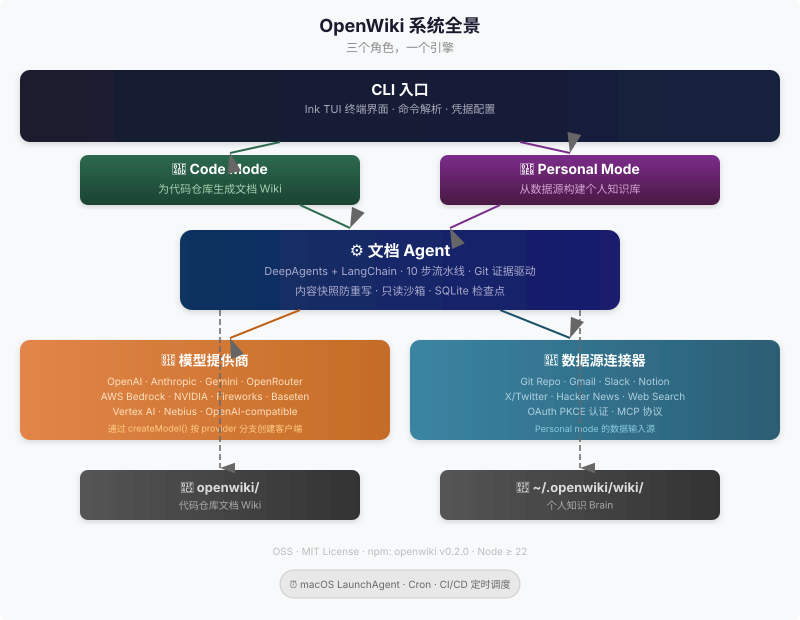

# 01 — 系统全景 (System Overview)

## 这是什么

OpenWiki 是一个运行在终端里的 CLI 工具，它做两件事：

1. **给代码仓库自动生成文档 Wiki**（Code Mode）——扫描你的 Git 仓库，用 AI 理解代码，写出一套结构化的 markdown 文档。
2. **帮你管理个人知识库**（Personal Mode）——从 Gmail、Slack、Notion、Hacker News 等数据源拉取信息，整理成你自己的"第二大脑"。

无论哪种模式，核心都是同一个 **文档 Agent（Documentation Agent）** 引擎在驱动。整个系统可以理解为**三个角色、一个引擎**——理解了这个，你就理解了 OpenWiki。

## 一张图看懂

## 三个角色

### CLI 入口——你和 OpenWiki 对话的地方

`openwiki` 命令是你唯一需要打的字。它是一个基于 Ink 的终端 UI（Terminal UI），提供交互式菜单、进度条和实时日志。两个命令覆盖全部工作流：

- `openwiki code` — 进入 Code Mode，为当前 Git 仓库生成文档 Wiki。
- `openwiki`（不带参数）— 进入 Personal Mode，配置数据源、触发数据摄入、生成个人知识库。

没有复杂的子命令树，没有需要记住的配置文件路径。打开终端，敲 `openwiki`，跟着提示走。

### 文档 Agent——引擎

文档 Agent 是 OpenWiki 的核心。它接收两组输入：**证据（evidence）**——来自 Git 历史、文件内容、代码结构的客观事实，以及**提示词（prompts）**——描述"写出什么样的文档"的指令。在 DeepAgents + LangChain 的基础上，Agent 执行一条条文书记录和修改的工具调用，最终输出结构化的 markdown 文件。

Agent 有几个关键的工程品质：

- **内容快照去重（Content Snapshot Dedup）**：写入前对比已有内容，避免同义反复。
- **只写沙箱（Docs-Only Write Sandbox）**：Agent 只能修改 `openwiki/` 目录下的文件，碰不到源码。
- **SQLite 检查点（Checkpointing）**：运行中途可以恢复，长文档生成任务不会因为断连而白跑。

### 模型提供商 + 数据源连接器——大脑和数据

Agent 需要两样东西才能工作：**推理能力**和**输入数据**。

**模型提供商（Model Providers）** 负责推理。OpenWiki 支持 9+ 家提供商——Anthropic、OpenAI、Gemini、OpenRouter、AWS Bedrock、NVIDIA、Fireworks、Baseten、Vertex AI 等。你选一个、配好 API key，Agent 就有了大脑。提供商之间有统一的创建接口，切换模型不需要改代码逻辑。

**数据源连接器（Data Connectors）** 负责供给数据——只在 Personal Mode 下生效。目前有 7 个连接器：Git Repo、Gmail、Slack、Notion、X/Twitter、Hacker News、Web Search。它们通过 OAuth PKCE 认证和 MCP 协议接入，把外部数据标准化后交给 Agent 处理。

Code Mode 不需要连接器——它直接从本地 Git 仓库提取证据。

## 两种模式一句话

**Code Mode** = 给你手上的 Git 仓库写文档，输出到 `openwiki/` 目录。**Personal Mode** = 把分散在各处的信息整理成一个个人知识库，输出到 `~/.openwiki/wiki/`。同一个引擎，不同的输入，不同的输出目的地。

## 接下来看什么

你不需要按顺序啃完所有文档。根据你想做的事，选一个入口：

| 你想了解... | 看这里 |
|-------------|--------|
| Code Mode 的完整流程——从敲命令到 wiki 生成 | `02-code-mode.md` |
| Personal Mode 怎么摄数据、建知识库 | `03-personal-mode.md` |
| Agent 内部怎么跑起来的——prompt、流水线、沙箱 | `04-agent-internals.md` |
| 想找一个具体函数的源码位置 | `../_context/02-entrypoints-at-a-glance.md` |

> 放轻松，这比看起来简单。一个 Agent 引擎，两种运行模式，加上模型和数据两层外挂。剩下的都是细节。

## Source Anchor

| 源文件 | 关键符号 | 说明 |
|--------|---------|------|
| `src/cli.tsx` | `App` 组件 | CLI 主入口，Ink TUI 根组件 |
| `src/agent/index.ts` | `createDeepAgent` | Agent 创建入口 |
| `src/commands.ts` | `CliCommand`、`parseCommand` | 命令解析与路由 |
| `src/constants.ts` | `resolveConfiguredProvider` | 模型提供商回退链 |
| `package.json` | — | 项目元数据（version、dependencies） |
