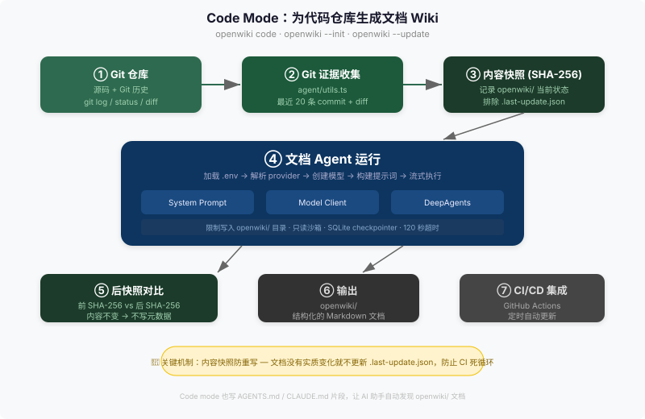

# 02 — Code Mode：为仓库生成文档 (Code Mode)

Code Mode 是 OpenWiki 两种运行模式之一。它输入一个 Git 仓库，输出一个结构化的文档 Wiki。整个流程是线性的：7 步，从仓库输入到 CI/CD 集成。

## Code Mode 做什么

Code Mode 对应 CLI 的几个入口：

- `openwiki code` — 启动 Code Mode 的交互式 TUI
- `openwiki code --init` — 首次为当前仓库生成完整 Wiki
- `openwiki code --update` — 增量更新已有 Wiki（只覆盖有变化的部分）
- `openwiki code --update --print` — 非交互模式，适合脚本和 CI

无论你用哪个入口，背后的流程是一样的。Code Mode 本质上做的事情：读取当前 Git 仓库的源码、Git 历史、文件结构，把这些作为"证据（evidence）"喂给文档 Agent，Agent 进行分析和推理，然后写出 `openwiki/` 目录下一个结构化的 markdown 文档集合。

Code Mode 的输出是一个完整的文档网站——包含快速入门（quickstart）、架构说明（architecture）、工作流（workflows）、领域概念（domain）、操作指南（operations）、集成信息（integrations）、测试指南（testing）和源码地图（source maps）。它本质上是在为你的仓库生成"对人和 AI 都友好"的技术文档。

## 一张图看懂



## 7 步流水线

### 1. Git 仓库输入

Code Mode 的运行目录（cwd）就是你的 Git 仓库根目录。Agent 从这里收集三类信息：

- **源码文件**：所有代码文件，通过虚拟文件系统后端提供只读访问。Agent 用 filesystem 工具读取文件内容、浏览目录结构。
- **Git 元数据**：`git status --short`、`git rev-parse HEAD`、recent commits 和 diff。init 时拉最近 20 条 commit；update 时只拉上一次成功运行之后的 commit。
- **仓库 Wiki 指令**：如果仓库根目录有 `openwiki/INSTRUCTIONS.md`，Agent 会先读取它作为"用户写好的生成指引"。

输入阶段的入口在 `src/agent/utils.ts:43-73` 的 `createRunContext`，它组装 `lastUpdate` 元数据、Git 摘要和 Wiki 目标（wikiGoal）。

### 2. Git 证据收集

`src/agent/utils.ts:337-402` 的 `createGitSummary` 负责生成送给 Agent 的 Git 证据文本块。证据的收集策略取决于命令类型：

- **init**：收集 `git status`、`git rev-parse HEAD`、最近 20 条 commit (`git log --max-count=20 --name-status --oneline`)、以及 `git diff --name-status HEAD`。
- **update**（有上次 gitHead）：收集 `git status`、`git rev-parse HEAD`、上次 gitHead 到当前 HEAD 之间的 commit (`git log <lastHead>..HEAD --name-status --oneline`)、以及 `git diff --name-status HEAD`。
- **update**（只有上次时间戳）：用 `git log --since <lastUpdate>` 替代精确的 commit 范围。

收集到的 Git 证据被格式化为 `$ <command>` + 输出的文本块，直接拼入 Agent 的 user prompt。Git 命令通过 `child_process.execFile` 执行，出错时不抛异常而是把 stderr 也拼入输出——因为"没有 git 历史"本身也是一条有效信息。

### 3. 内容快照（Before）

在 Agent 运行之前，`src/agent/utils.ts:196-206` 的 `createOpenWikiContentSnapshot` 对当前的 `openwiki/` 目录做一次 SHA-256 哈希快照。

快照的规则：
- 递归遍历 `openwiki/` 下所有文件和子目录。
- 对每个文件，哈希 `<相对路径>\0<文件内容>\0`。
- 对每个目录，哈希 `dir:<相对路径>\0`。
- 条目按字母序排序，保证跨平台可重复。
- **排除** `.last-update.json`（即 `openwiki/.last-update.json`）——因为它是元数据，不是文档内容。
- 如果 `openwiki/` 目录尚不存在（首次 init），快照值为空目录的哈希。

这个快照用于第 5 步的对比。调用位置在 `src/agent/index.ts:216-220`，紧接在创建 Agent 之前：

```typescript
const openWikiSnapshotBefore =
  command === "chat"
    ? null
    : await createOpenWikiContentSnapshot(cwd, outputMode);
```

### 4. Agent 运行

这是流水线的核心，发生在 `src/agent/index.ts:205-354` 的 `runOpenWikiAgentCore`。

Agent 的创建过程：

1. **解析 Provider**：`resolveConfiguredProvider()` 从环境变量（`OPENWIKI_PROVIDER`）或 `.env` 文件中确定使用哪个模型提供商。
2. **创建模型**：`createModel(provider, modelId, providerRetryAttempts)` 按提供商分支创建对应的 LangChain ChatModel 实例。
3. **构建系统提示词**：`createSystemPrompt(command, "repository")` 生成 Code Mode 专用的系统提示词（详见 `src/agent/prompt.ts`），包含文档输出路径（`openwiki/`）、Git 证据使用规则、文件系统边界（不碰源码）等指令。
4. **组装工具和沙箱**：
   - `OpenWikiLocalShellBackend` 作为虚拟文件系统后端，`docsOnly: true` 限制 Agent 只能写入 `openwiki/` 目录。
   - `CompositeBackend` 组合 Wiki 后端和 Skills 后端（`/skills/` 路径映射到 `~/.openwiki/skills/`），但 Skills 是只读的。
   - 120 秒超时（`timeout: 120`），单文件最大 100KB。
5. **创建 DeepAgents Agent**：`createDeepAgent({ model, tools, checkpointer, backend, middleware, skills, permissions, systemPrompt })`。
   - 检查点（checkpointer）：SQLite 持久化，支持断点续跑。
   - 中间件（middleware）：在非 chat 模式下挂载 `createOpenWikiIndexMiddleware`，用于生成索引页。
6. **构建 User Message**：`createRunUserMessage` 把 Git 证据、Wiki 目标、运行环境信息拼成一条 user prompt。
7. **流式执行**：Agent 通过 `streamEvents` 流式输出，每个事件（text、tool_start、tool_end）通过回调输出给 CLI 的 `--print` 模式或 TUI。

当 Agent 运行时，它会调用 filesystem 工具读取源码文件，分析代码和 Git 历史，然后调用 write 工具往 `openwiki/` 目录下创建和更新 markdown 文件。

### 5. 后快照对比

Agent 运行结束后，`src/agent/utils.ts:171-191` 的 `persistRunMetadataIfChanged` 再次对 `openwiki/` 做 SHA-256 快照，与之前的前快照对比。

如果内容**没有变化**（两个 SHA-256 完全相同）：不写 `.last-update.json`。这是防重写机制的核心。

如果内容**发生了变化**：调用 `writeLastUpdateMetadata`，写入包含时间戳、命令类型、gitHead、model 的元数据到 `openwiki/.last-update.json`。

这段逻辑在 `src/agent/index.ts:331-348`，在 Agent 流式执行完成后执行。即使 Agent 抛异常，也会在 catch 块中（`index.ts:308-322`）尝试写入元数据——已经生成的内容仍然可以成为未来 diff 的基线。

### 6. 输出

Agent 的输出全部落在 `openwiki/` 目录下。一个典型的输出结构：

```
openwiki/
├── quickstart.md              # 快速入门
├── architecture/
│   ├── overview.md            # 架构概览
│   └── source-map.md          # 源码地图
├── workflows/                 # 工作流文档
├── domain/                    # 领域概念
├── operations/                # 运维指南
├── integrations/              # 集成说明
├── testing/                   # 测试指南
├── _plan.md                   # Agent 内部执行计划（运行后清理）
└── .last-update.json          # 元数据（内容有变化时才写）
```

实际生成哪些文件和目录取决于 Agent 的判断——它会根据仓库规模和结构决定是否需要分目录、哪些主题值得独立成篇。

### 7. CI/CD 集成

Code Mode 天生支持 CI/CD。在 `openwiki code --init` 时，`src/code-mode.ts:17-19` 的 `ensureCodeModeRepoSetup` 会自动做两件事：

1. **写入 GitHub Actions 工作流**：在 `.github/workflows/openwiki-update.yml` 创建一个定时任务文件，默认每天早上 8 点（cron: `0 8 * * *`）运行 `openwiki code --update --print`。
2. **写入 Agent 发现片段**：在 `AGENTS.md` 和 `CLAUDE.md` 中写入/更新一个 `<!-- OPENWIKI:START -->...<!-- OPENWIKI:END -->` 片段，告诉 AI 助手这个仓库有自动生成的 OpenWiki 文档。

GitHub Actions 工作流的行为：
- `schedule` + `workflow_dispatch`：定时自动运行，也支持手动触发。
- 只在源仓库或 opt-in 的 fork 中执行定时任务（`if: github.repository == 'langchain-ai/openwiki' || vars.OPENWIKI_ENABLE_SCHEDULED_UPDATE == 'true'`）。
- 依赖一个 peter-evans/create-pull-request action，把 Agent 生成的更新用 PR 方式提交。
- 输出范围（`add-paths`）：`openwiki/`、`AGENTS.md`、`CLAUDE.md`、workflow 文件本身。

## 防重写机制

防重写（Anti-Rewrite）是 Code Mode 最关键的工程决策之一。它的逻辑很简单：

**如果文档内容没有实质变化，就不要更新 `.last-update.json`。**

为什么要这么做？因为 `.last-update.json` 中记录了 gitHead。如果 Agent 每次运行都更新它，即使在"内容没有变化"的情况下，gitHead 也会被推进。下一次 CI 运行时，gitHead 变了，Agent 就会认为"有新变更需要处理"，于是再次运行——形成死循环。

机制分为两层：

**第一层：update noop 检查**（Agent 运行前）。`src/agent/utils.ts:86-135` 的 `getUpdateNoopStatus` 在 Agent 启动前判断是否真的需要运行：

- 没有上次 gitHead 记录？→ 需要运行（首次 update）。
- 当前 gitHead 等于上次 gitHead？→ 需要运行（worktree 可能有未 commit 的变更）。
- 当前 gitHead 变了，但所有变更都在 `openwiki/` 目录内？→ **跳过**（只有 Wiki 自己的文件变了，源码没变）。
- 当前 gitHead 变了，且有 `openwiki/` 外的文件变更？→ 需要运行。

只有 `getUpdateNoopStatus` 返回 `shouldSkip: false` 时，Agent 才真正启动。

**第二层：内容快照对比**（Agent 运行后）。即使 Agent 运行了，如果生成的文档和运行前一模一样（SHA-256 一致），`persistRunMetadataIfChanged` 也不会写 `.last-update.json`。这意味着下次 CI 运行时，gitHead 仍然是旧的——noop 检查会正确跳过。

两层机制配合，保证 CI 只在新源码变更产生新文档内容时才产生新的 PR。

## Code Mode 还做什么

除了生成 Wiki 文档，Code Mode 还负责两项"基建"工作：

1. **写入 AGENTS.md / CLAUDE.md 片段**：`src/code-mode.ts:35-43` 的 `writeCodeModeAgentSnippets` 在仓库根目录的这两个文件中插入或更新 `<!-- OPENWIKI:START -->...<!-- OPENWIKI:END -->` 片段。片段内容固定为一段英文指引，告诉 AI 助手从 `openwiki/quickstart.md` 开始阅读、不要手改自动生成的页面。如果文件已存在且已有该片段，就只替换片段内的内容；如果文件不存在，就创建并写入片段。
2. **写入 GitHub Actions 工作流**：`src/code-mode.ts:21-33` 的 `writeCodeModeWorkflow` 创建 `.github/workflows/openwiki-update.yml`，为仓库配置定时自动更新。

这两个动作都在 `ensureCodeModeRepoSetup` 中完成，在 `src/cli.tsx:3974-3976` 的 code 模式路由中调用。

## 与 Personal Mode 的区别

Code Mode 和 Personal Mode 共享同一个文档 Agent 引擎（`runOpenWikiAgent`），但架构上有本质区别：

| 维度 | Code Mode | Personal Mode |
|------|-----------|---------------|
| 输出目录 | `openwiki/`（仓库内） | `~/.openwiki/wiki/`（用户家目录） |
| outputMode | `"repository"` | `"local-wiki"` |
| 数据来源 | Git 仓库源码 + Git 历史 | 数据连接器（Gmail、Slack、Notion 等） |
| 需要连接器 | 否 | 是（7 个连接器，通过 OAuth/MCP 接入） |
| 需要认证 | 否（只有模型 API key） | 是（每个连接器 OAuth 独立认证） |
| 证据来源 | git log/status/diff | 连接器原始数据（connector raw dumps） |
| 系统提示词 | 面向仓库文档生成 | 面向个人知识管理 |
| 写入边界 | 只能写 `openwiki/` | 只能写 `~/.openwiki/wiki/` |
| CI/CD | 原生支持（GitHub Actions） | 通过 macOS LaunchAgent 定时调度 |
| Agent 指令文件 | 管理 AGENTS.md/CLAUDE.md | 不碰仓库级文件 |
| 防重写依据 | Git commit hash | 连接器数据时间戳 |
| 复杂度 | 低——7 步线性流水线 | 高——需摄入流水线、OAuth 认证、数据标准化 |

一句话：Code Mode 是"给仓库写文档"，Personal Mode 是"给你写知识库"。Code Mode 没有连接器、没有认证、没有摄入流水线——它更简单，因为输入是一个明确的、不用认证的、结构清晰的 Git 仓库。

## 关键源文件

| 源文件 | 关键符号 | 说明 |
|--------|---------|------|
| `src/cli.tsx:3971-3976` | `runPrintCommand` 中的 code 路由 | CLI 入口，判断 mode==="code" 时调用 `ensureCodeModeRepoSetup` |
| `src/code-mode.ts:13-19` | `ensureCodeModeRepoSetup` | Code Mode 仓库初始化：写工作流 + Agent 发现片段 |
| `src/agent/index.ts:96-203` | `runOpenWikiAgent` | Agent 运行主流程：加载环境、noop 检查、创建模型、核心运行 |
| `src/agent/index.ts:205-354` | `runOpenWikiAgentCore` | Agent 核心：前快照 → 创建 Agent → 流式执行 → 后快照对比 → 元数据持久化 |
| `src/agent/utils.ts:43-73` | `createRunContext` | 组装 Agent 运行的上下文：lastUpdate、Git 摘要、Wiki 目标 |
| `src/agent/utils.ts:86-135` | `getUpdateNoopStatus` | Update 前的 noop 判断：无变化则跳过 Agent 运行 |
| `src/agent/utils.ts:171-191` | `persistRunMetadataIfChanged` | 内容快照对比 + 条件写入 .last-update.json |
| `src/agent/utils.ts:196-206` | `createOpenWikiContentSnapshot` | SHA-256 快照：递归哈希 openwiki/ 目录 |
| `src/agent/utils.ts:337-402` | `createGitSummary` | Git 证据收集：status / log / diff |
| `src/agent/prompt.ts` | `createSystemPrompt(command, "repository")` | Code Mode 专用系统提示词 |
| `src/agent/types.ts:1-2` | `OpenWikiCommand`、`OpenWikiOutputMode` | 命令类型与输出模式类型定义 |
| `src/constants.ts:1-2` | `OPEN_WIKI_DIR`、`UPDATE_METADATA_PATH` | 常量：openwiki 目录名和元数据文件路径 |

## Source Anchor

| 源文件 | 关键符号 | 说明 |
|--------|---------|------|
| `src/cli.tsx:3971-3976` | code mode routing in `runPrintCommand` | Code Mode 命令路由入口 |
| `src/code-mode.ts:13-19` | `ensureCodeModeRepoSetup` | 仓库初始化和工作流写入 |
| `src/code-mode.ts:35-43` | `writeCodeModeAgentSnippets` | AGENTS.md/CLAUDE.md 片段管理 |
| `src/code-mode.ts:69-121` | `createCodeModeWorkflow` | GitHub Actions 工作流 YAML 生成 |
| `src/agent/index.ts:96-203` | `runOpenWikiAgent` | Agent 运行主入口 |
| `src/agent/index.ts:205-354` | `runOpenWikiAgentCore` | Agent 核心运行逻辑 |
| `src/agent/index.ts:449-452` | `createOpenWikiThreadId` | 基于 cwd 的线程 ID 生成 |
| `src/agent/utils.ts:43-73` | `createRunContext` | 运行上下文组装 |
| `src/agent/utils.ts:86-135` | `getUpdateNoopStatus` | Update noop 判断 |
| `src/agent/utils.ts:171-191` | `persistRunMetadataIfChanged` | 条件写入元数据 |
| `src/agent/utils.ts:196-206` | `createOpenWikiContentSnapshot` | SHA-256 内容快照 |
| `src/agent/utils.ts:337-402` | `createGitSummary` | Git 证据收集 |
| `src/agent/prompt.ts:427-458` | code mode section of `createSystemPrompt` | Code Mode 系统提示词 |
| `src/agent/types.ts:1-2` | `OpenWikiCommand`、`OpenWikiOutputMode` | 类型定义 |
| `src/constants.ts:1-2` | `OPEN_WIKI_DIR`、`UPDATE_METADATA_PATH` | 目录和路径常量 |
| `.github/workflows/openwiki-update.yml` | scheduled workflow | 生产环境的 CI/CD 工作流 |
