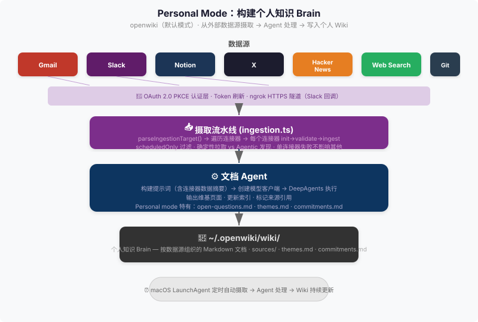

# 03 — Personal Mode：构建个人知识库 (Personal Mode)

## 1. Personal Mode 做什么

Personal Mode 是 OpenWiki 的默认运行模式 (`openwiki` 命令不带 `--code` 选项即为 personal mode)。它的核心目标：**从用户连接的外部数据源（Gmail、Slack、Notion 等）定期拉取数据，由 Agent 消化整理后，写回 `~/.openwiki/wiki/`，形成一个持续更新的个人知识 brain**。

```
外部数据源 → 认证层 → 摄取流水线 → Agent 处理 → ~/.openwiki/wiki/
```

与 Code Mode 的不同：Code Mode 以"理解一个代码仓库并生成文档"为目标，而 Personal Mode 以"理解一个人的信息流并持续维护知识库"为目标。两者共享同一套 Agent 引擎 (`src/agent/index.ts`)，但使用不同的提示词（prompt）策略和输出格式。

## 2. 一张图看懂



## 3. 四层流水线

Personal Mode 的数据流分为四个层次：数据源层（拉什么）、认证层（怎么授权）、摄取层（怎么拉）、Agent 处理层（怎么消化）。每一层都是独立的关注点。

### 3.1 数据源层：7 个连接器（Connector）

数据源由 `src/connectors/registry.ts` 中的 `createConnectorRegistry()` 统一注册，共 7 个连接器，每个连接器返回一个 `ConnectorRuntime` 对象（`src/connectors/types.ts:40-42`），包含 `backend`、`supportsAgenticDiscovery`、`ingest()` 等字段：

| 连接器 ID | 显示名称 | 后端类型 | 确定性拉取？ | 数据来源与说明 |
|-----------|---------|---------|------------|--------------|
| `google` | Gmail | `direct-api` | 是 | 通过 Gmail API 拉取最近邮件，支持自定义查询（`query`）、标签过滤（`labelIds`），输出 `gmail-messages.json` |
| `slack` | Slack | `direct-api` | 是 | 通过 Slack API 拉取私信和频道消息，包括自我消息搜索（`my_messages_search`）和最近会话回退（`recent_messages`），输出 `identity.json` + `my-recent-messages.json` |
| `notion` | Notion | `mcp-stdio` | 否（Agentic） | 通过 MCP（Model Context Protocol）连接 Notion，需要 `OPENWIKI_NOTION_MCP_ACCESS_TOKEN` 环境变量。Agent 通过 MCP 工具按需发现和检索页面 |
| `x` | X（Twitter） | `direct-api` | 是 | 通过 X API v2 拉取时间线、用户帖子、提及、书签、列表帖子，默认启用全部 5 个 stream（`home_timeline`、`user_posts`、`mentions`、`bookmarks`、`list_posts`） |
| `hackernews` | Hacker News | `direct-api` | 是 | 拉取 HN 公开 feed（`top`、`new`、`best`、`ask`、`show`、`job`）+ Algolia 搜索查询，输出 `hackernews-results.json` |
| `web-search` | Web Search | `direct-api` | 是 | 通过 Tavily（LangChain 集成）执行网页搜索，需要 `TAVILY_API_KEY`，支持自定义查询列表（`queries`）、搜索深度和时间范围，输出 `web-search-results.json` |
| `git-repo` | Local Git Repos | `local-git` | 否（Agentic） | 读取本地克隆的 Git 仓库，生成紧凑的 manifest（repo 路径、分支、HEAD、状态、变更文件、最近提交）。Agent 直接检查仓库文件系统而非复制全部内容 |

**关键设计**：`supportsAgenticDiscovery` 字段区分两类连接器：
- **确定性拉取**（Deterministic Pull，`supportsAgenticDiscovery === false`）：连接器的 `ingest()` 方法自己完成数据拉取，写入原始文件（raw files），Agent 只需读取这些文件做综合。适用于 Gmail、Slack、X、HN、Web Search。
- **Agentic 发现**（Agentic Discovery，`supportsAgenticDiscovery === true`）：连接器不做确定性拉取，而是为 Agent 提供工具/权限让 Agent 自行探索。适用于 Notion（通过 MCP 工具）和 Git Repo（直接检查本地文件系统）。

### 3.2 认证层：OAuth 2.0 PKCE

数据源中需要用户授权的（Gmail、Slack、X），通过 OAuth 2.0 PKCE（Proof Key for Code Exchange）流程完成认证（`src/auth/oauth.ts`）：

1. **PKCE 流程**：生成 `code_verifier`（64 字节随机字符串）和 `code_challenge`（SHA-256 hash），打开浏览器让用户在提供商页面授权
2. **本地回调服务器**：启动 `127.0.0.1:53682` 的 HTTP 服务器接收授权回调（code），回调端口可通过 `OPENWIKI_OAUTH_CALLBACK_PORT` 环境变量修改
3. **Token 交换与刷新**：用 code 换取 access_token + refresh_token，存储在 `~/.openwiki/` 下。连接器运行时通过 `src/auth/tokens.ts` 的 `getOAuthAccessToken()` / `refreshOAuthAccessToken()` 自动管理 token 生命周期
4. **Slack 特殊需求 —— ngrok 隧道**：Slack 的 OAuth 回调要求 HTTPS URL，而本地回调是 `http://127.0.0.1`。`src/auth/ngrok.ts` 使用 ngrok 创建 HTTPS 公网隧道（`startNgrokTunnel()`），将 ngrok URL 设为 redirect URI，回调被 ngrok 转发回本地端口。HTTPS redirect URI 存储在 `OPENWIKI_HTTPS_OAUTH_REDIRECT_URI` 环境变量中

不需要 OAuth 的连接器：Hacker News（公开 API）、Web Search（Tavily API Key）、Git Repo（本地文件系统）。Notion 通过 `OPENWIKI_NOTION_MCP_ACCESS_TOKEN` 环境变量直接配置 token。

### 3.3 摄取层：`ingestion.ts` 编排

`src/ingestion.ts` 是整个摄取流水线的编排器（orchestrator），核心入口是 `runOpenWikiIngestion()`（第 59 行）：

```
parseIngestionTarget() → resolveIngestionSourceInstances() → for each source: runSourceIngestion()
```

**步骤拆解**：

1. **`parseIngestionTarget()`**（第 101 行）：解析用户指定的摄取目标，可以是 `"all"`（全部连接器）、单个 connector ID（如 `"google"`）、或特定 source instance ID

2. **`resolveIngestionSourceInstances()`**（第 206 行）：从 `~/.openwiki/onboarding.json`（`src/onboarding.ts`）读取已配置的 source instances，按目标过滤：
   - 仅返回 `connectedAt` 存在的（已完成首次配置的）
   - `scheduledOnly` 模式下跳过 paused 状态的 schedule

3. **`runSourceIngestion()`**（第 118 行）：对每个 source instance 依次执行：
   - **确定性拉取**（如果是确定性连接器）：调用 `connector.ingest()`，传入 `windowHours=24`（最近 24 小时数据）
   - **Agent 更新**：调用 `runOpenWikiAgent("update", ...)` 并传入 `outputMode: "local-wiki"`，Agent 会根据 source 类型执行不同的处理策略
   - **容错设计**：单个连接器失败 **不会阻断** 其他连接器的摄取——每个 source 的 `runSourceIngestion()` 都有独立的 try/catch（第 193 行），失败后记录 error 状态并继续处理下一个

4. **24 小时摄取窗口**：`INGESTION_WINDOW_HOURS = 24`（第 28 行），所有连接器的确定性拉取默认取最近 24 小时数据

### 3.4 Agent 处理层

Personal Mode 和 Code Mode 共享同一个 Agent 引擎（`src/agent/index.ts` 的 `runOpenWikiAgent()`），但 Personal Mode 使用 `outputMode: "local-wiki"`，会触发不同的 prompt 策略。

**Personal Mode 特有的合成策略**（定义在 `src/ingestion.ts` 的 `createSourceSynthesisPolicy()` 第 333 行和 `createConnectorSynthesisGuidance()` 第 347 行）：

1. **跨源综合**：数据不按 source 孤立存放，而是综合到跨源规范文件（canonical cross-source files）中
2. **置信度标签**：每条信息标记为 `confirmed`、`source-backed`、`watchlist` 或 `saved-context`
3. **去重**：使用稳定的 topic key 去重，更新已有的 themes、open questions、commitments，不在多个 source 页面中重复同一事实
4. **按连接器定制策略**：每个连接器有专用的合成指南：
   - Gmail：分类为 `action_required` / `scheduled_commitment` / `decision_or_approval` 等 13 个类别，只写高/中优先级且持久的信息
   - Slack：工作请求、提及、截止日期路由到 commitments.md
   - Notion：按 `last_edited_time`、提及、人员属性筛选，保持 `/sources/notion.md` 精简
   - X：书签和喜欢的内容默认为 `saved-context`，仅重复出现或高信号时提升到 themes.md
   - Hacker News：低参与度条目默认为 `watchlist`，仅重复/高参与/多源印证时提升
   - Web Search：单弱结果标记为 `watchlist`，跨查询合并到已有主题
   - Git Repo：用仓库路径、分支、HEAD、提交作为证据，不镜像仓库清单

**Agent 创建用户消息**：`createSourceUpdateMessage()`（第 254 行）根据是否确定性拉取生成不同的用户提示，包含 wiki goal、source 特定指令、合成策略、以及确定性拉取的原始数据文件路径。

## 4. Personal Brain 的特殊文件

Personal Mode 的 Agent 会将综合结果写入 `~/.openwiki/wiki/` 下的四类规范文件（canonical files），这些文件是 personal brain 的核心结构：

| 文件 | 用途 | 结构约定 |
|------|------|---------|
| `open-questions.md` | 记录用户核心记忆/wiki 质量中的不确定性 | **Active**（Owner、Seen、Evidence、Notes）→ **Answered**（Evidence 指向答案、Answered 日期）→ **Stale**（Why、Last seen）。注意：不是记录源文档中出现的开放问题，而是记录会影响未来辅助质量的 wiki 本身的不确定性 |
| `themes.md` | 跨源趋势索引 | 紧凑索引：倾向表格行或每条一个简短字段条目，描述性文本不超过 1-2 句，细节和例子留在 source pages 中 |
| `commitments.md` | 工作任务和待办 | 每个条目包含 **Owner**（me / team / other:name / unknown）。来自 Gmail 的 action items、Slack 的直接请求和截止日期、Notion 的指派任务等都会被路由到这里 |
| `personal-logistics.md` | 非工作类生活管理事项 | 来自 Gmail 的物流类邮件（`personal_logistics` 分类）、安排、预约等 |

## 5. 定时自动运行

Personal Mode 支持通过 macOS LaunchAgent 实现定时自动摄取（`src/schedules.ts`, 919 行）：

**调度机制**：
- 用户通过 CLI 配置 cron 表达式：`openwiki cron` 相关子命令
- `installConnectorSchedule()`（第 127 行）将 cron 表达式转换为 macOS `launchd` 的 `StartCalendarInterval` 格式，写入 `~/Library/LaunchAgents/com.openwiki.ingestion.plist`
- LaunchAgent 的 `ProgramArguments` 为：`node <cli-path> ingest all --scheduled --print`
- 定时触发时，自动执行全部已配置连接器的摄取流水线，输出写入日志文件 `~/.openwiki/logs/ingestion.schedule.log`

**电源管理集成**：
- 可配置 macOS `pmset` 的 wake/sleep 定时，在摄取调度前自动唤醒 Mac（`installOpenWikiPowerSchedule()`, 第 348 行）
- 唤醒时间 = 最早 cron 时间 - 2 分钟，睡眠时间 = 最晚 cron 时间 + 30 分钟

**暂停与恢复**：
- `pauseConnectorSchedules()`（第 225 行）：通过设置 `pausedAt` 时间戳暂停，同时 unload LaunchAgent 和取消 pmset 唤醒
- `resumeConnectorSchedules()`（第 265 行）：清除 `pausedAt`，重新安装 LaunchAgent 和 pmset 唤醒
- `deleteConnectorSchedules()`（第 318 行）：完全移除 schedule 配置、LaunchAgent plist 和 pmset 唤醒

## 6. 关键源文件

| 源文件 | 关键符号 | 说明 |
|--------|---------|------|
| `src/ingestion.ts:59` | `runOpenWikiIngestion()` | 摄取流水线总入口，遍历 source instances |
| `src/ingestion.ts:101` | `parseIngestionTarget()` | 解析摄取目标（"all" / connector ID / source instance ID） |
| `src/ingestion.ts:118` | `runSourceIngestion()` | 单 source 摄取：确定性拉取 + Agent 更新 |
| `src/ingestion.ts:333` | `createSourceSynthesisPolicy()` | 跨源综合策略，定义四类规范文件的写入规则 |
| `src/ingestion.ts:347` | `createConnectorSynthesisGuidance()` | 按连接器定制的合成指南（Gmail 分类、Slack 路由等） |
| `src/connectors/registry.ts:20` | `createConnectorRegistry()` | 注册全部 7 个连接器 |
| `src/connectors/types.ts:1-8` | `ConnectorId` | 连接器 ID 联合类型（7 个取值） |
| `src/connectors/types.ts:40-42` | `ConnectorRuntime` | 连接器运行时接口（definition + ingest 方法） |
| `src/connectors/types.ts:19-21` | `supportsAgenticDiscovery` | 区分确定性拉取与 Agentic 发现的关键字段 |
| `src/auth/oauth.ts:52` | `runOAuthAuth()` | OAuth 2.0 PKCE 授权流程入口 |
| `src/auth/ngrok.ts:23` | `startNgrokTunnel()` | 为 Slack OAuth 回调创建 ngrok HTTPS 隧道 |
| `src/auth/tokens.ts` | `getOAuthAccessToken()`, `refreshOAuthAccessToken()` | Token 获取与自动刷新 |
| `src/schedules.ts:127` | `installConnectorSchedule()` | 安装 macOS LaunchAgent 定时任务 |
| `src/schedules.ts:225` | `pauseConnectorSchedules()` | 暂停定时调度（unload LaunchAgent + 取消唤醒） |
| `src/schedules.ts:348` | `installOpenWikiPowerSchedule()` | 配置 pmset 唤醒/sleep 与调度对齐 |
| `src/schedules.ts:786` | `createLaunchAgentPlist()` | 生成 LaunchAgent plist XML |
| `src/agent/index.ts` | `runOpenWikiAgent()` | Agent 运行入口（Personal 和 Code Mode 共享） |
| `src/agent/prompt.ts:16` | `createSystemPrompt()` | Agent 系统提示词，`outputMode: "local-wiki"` 触发 personal mode 分支 |
| `src/agent/types.ts:1-2` | `OpenWikiCommand`, `OpenWikiOutputMode` | 命令类型与输出模式类型 |
| `src/onboarding.ts:8-16` | `openWikiOnboardingPath`, `OnboardingSourceInstanceConfig` | 首次配置路径与 source instance 配置类型 |
| `src/commands.ts:12` | `OpenWikiRunMode` | 运行模式联合类型：`"personal" | "code"` |
