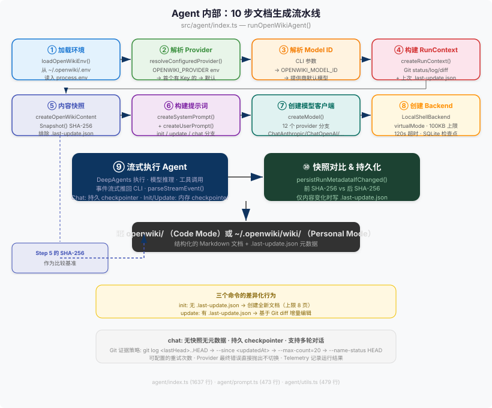

# 04 -- Agent 内部机制 (Agent Internals)

## 1. Agent 是什么

OpenWiki 的 Agent 不是一个通用的聊天机器人。它是一个受约束的 10 步流水线（10-step pipeline），将 git 证据（git evidence）、命令类型（command type）和仓库上下文（repo context）转化为结构化 markdown 文档，写入 `openwiki/` 目录。

- **输入（Input）**：命令类型 `"init" | "update" | "chat"` + git 状态/日志/diff + 仓库 wiki goal（来自 `INSTRUCTIONS.md` 或 onboarding 配置） + 上一次运行的元数据（metadata）。
- **输出（Output）**：结构化的 OKF markdown 文档，写入 `openwiki/`（code mode）或 `~/.openwiki/wiki/`（personal mode）。
- **核心源文件**：`src/agent/index.ts`（1637 行）是整个流水线的编排器。所有 10 个步骤都从此文件出发。

Agent 不暴露 HTTP API，不维护长期运行的进程。每次 CLI 调用都是一次独立的进程内生命周期：加载环境 -> 解析配置 -> 构建上下文 -> 运行 LLM -> 持久化结果。

---

## 2. 一张图看懂



上图展示了 Agent 从启动到退出的完整 10 步流水线。每一步将在下一节详解。

---

## 3. 10 步详解 (10-Step Pipeline Walkthrough)

### 步骤 1: 加载环境 (Load Environment)

`loadOpenWikiEnv()` 读取 `~/.openwiki/.env` 文件，将其中的 key=value 对写入 `process.env`（仅当该 key 尚未被 `process.env` 设置时，即 process.env 优先级高于文件）。来源：`src/env.ts:169-178`。

这确保了所有 provider 的 API key、base URL、region 等环境变量在后续步骤中可用。加载完成后，`syncBundledSkills()` 将内置 skills 同步到 `~/.openwiki/skills/` 目录（来源：`src/agent/index.ts:112-113`）。

### 步骤 2: 解析 Provider (Resolve Provider)

`resolveConfiguredProvider()` 按优先级链确定使用哪个 AI provider（来源：`src/constants.ts:539-563`）：

```
OPENWIKI_PROVIDER 环境变量
  -> 检测到 OPENAI_API_KEY -> openai
  -> 检测到 OPENAI_COMPATIBLE_API_KEY -> openai-compatible
  -> 检测到 OPENROUTER_API_KEY -> openrouter
  -> 检测到 ANTHROPIC_API_KEY -> anthropic
  -> 检测到 BASETEN_API_KEY -> baseten
  -> 检测到 FIREWORKS_API_KEY -> fireworks
  -> 检测到 NEBIUS_API_KEY -> nebius
  -> 检测到 NVIDIA_API_KEY -> nvidia
  -> 检测到 BEDROCK_AWS_ACCESS_KEY_ID -> bedrock
  -> DEFAULT_PROVIDER ("openai")
```

这是一个纯自动检测链（auto-detection chain）。如果用户设置了 `OPENWIKI_PROVIDER`，跳过所有检测。否则，扫描已知 API key 环境变量，使用第一个匹配的 provider。如果全部未找到，回退到 `DEFAULT_PROVIDER`（`"openai"`）。

### 步骤 3: 解析 Model ID (Resolve Model ID)

`resolveModelId()` 按三级优先级确定使用哪个模型（来源：`src/agent/index.ts:534-558`）：

1. CLI 参数 `--modelId <id>` 传入的 `options.modelId`
2. 环境变量 `OPENWIKI_MODEL_ID`
3. Provider 的默认模型（`getDefaultModelId(provider)`，即该 provider 的 `modelOptions` 数组第一个元素）

解析后还会做 `normalizeModelId()`（trim + toLowerCase）和 `isValidModelId()` 校验。

### 步骤 4: 构建 RunContext (Build Run Context)

`createRunContext()` 收集三种证据来构建运行时上下文（来源：`src/agent/utils.ts:43-73`）：

| 证据项 | chat | init | update | 说明 |
|--------|------|------|--------|------|
| `lastUpdate` | 读取但不使用 | 读取，用于了解已有文档 | 读取，用于推算增量变更 | 上次运行的元数据（git head、model、时间戳） |
| `gitSummary` | 返回 "Not applicable" | `git status` + `git log -20` + `git diff HEAD` | 基于 `lastUpdate.gitHead` 做增量 `git log A..B`，若无 gitHead 则用时间戳做 `git log --since` | git 证据块，直接嵌入 user prompt |
| `wikiGoal` | 读取 | 读取 | 读取 | 来自 `INSTRUCTIONS.md`（code mode）或 onboarding 配置（personal mode） |

对于 `local-wiki` 模式，git 证据被跳过，prompt 中嵌入替代说明。

### 步骤 5: 内容快照 (Content Snapshot)

`createOpenWikiContentSnapshot()` 在 Agent 执行前对整个 `openwiki/` 目录做 SHA-256 哈希（来源：`src/agent/utils.ts:196-206`）。算法如下：

- 递归遍历 `openwiki/` 目录的所有文件和子目录
- **排除** `.last-update.json`（即 run metadata 文件本身，避免自引用）
- 按文件名字典序排序，确保确定性
- 对每个文件：写入 `file:<relativePath>\0` + 文件全部字节 + `\0`
- 对每个目录：写入 `dir:<relativePath>\0`
- 如果文件/目录在读取时消失（race condition），写入 `"missing"` 标记

最终产出 64 字符的 hex digest。这是 "before" 快照，将在步骤 10 与 "after" 快照比较。

**chat 命令跳过此步骤** -- chat 不修改文档，快照无意义。

### 步骤 6: 构建提示词 (Build Prompts)

提示词分为两块（来源：`src/agent/prompt.ts`）：

#### 6a. 系统提示词 (System Prompt) -- `createSystemPrompt()`

`src/agent/prompt.ts:16-205`（~190 行）。这是一份产品规则编码为 LLM 指令的长文档。包括：

- **角色定义**：OpenWiki 是 expert technical writer, software architect, product analyst
- **输出模式配置**：`local-wiki` vs `repository` 两套完全不同的行为规则（通过 `getOutputPromptConfig()` 在 `src/agent/prompt.ts:336-460` 返回不同的 `OutputPromptConfig`）
- **运行纪律（Run Discipline）**：文件系统路径规则、搜索范围、写入边界
- **Connector 摄入纪律**：7 个数据源的详细使用规则、never ask for secrets、deduplication
- **Subagent 纪律**：何时用、多少并行、只读 vs 写入许可
- **规划纪律**：先写 `_plan.md` 再做最终文档，跑完删除
- **OKF front matter 要求**：每个 md 文件必须包含 YAML front matter
- **安全规则**：不读 .env、不写源码
- **模式特定行为**：`createModeInstructions()` 为 init/update/chat 发出完全不同的行为约束（`src/agent/prompt.ts:207-260`）

#### 6b. 用户提示词 (User Prompt) -- `createUserPrompt()`

`src/agent/prompt.ts:262-310`。根据命令类型生成变体：

- **chat**：直接使用用户的输入消息
- **init**：要求从头构建文档，嵌入 `gitSummary` 和 `wikiGoal`
- **update**：要求增量刷新，嵌入 `lastUpdate`（上次运行元数据）、`gitSummary`（增量 git 变更）、`wikiGoal`

最终在 `createRunUserMessage()` 中组装为完整消息（`src/agent/index.ts:363-390`），附加运行时根路径和路径规则提示。

### 步骤 7: 创建模型客户端 (Create Model Client)

`createModel()` 根据 resolved provider 创建 LangChain 聊天模型实例（来源：`src/agent/index.ts:560-685`）。12 个 provider 分支：

| Provider | 客户端类型 | 关键配置 |
|----------|-----------|---------|
| `gemini` | `ChatGoogle` | `platformType: "gai"`, Gemini 3.x thought-signature workaround |
| `gemini-enterprise` | 路由到 `ChatGoogle` / `ChatAnthropic` + `AnthropicVertex` / `ChatOpenAI` | 根据 model ID 通过 `resolveVertexSurface()` 选择 API surface（来源：`src/agent/index.ts:744-809`） |
| `anthropic` | `ChatAnthropic` | 可选自定义 `anthropicApiUrl` |
| `openai-chatgpt` | `ChatOpenAI` | 使用 Responses API (`useResponsesApi: true`)，非流式被禁用，账号级 headers，Codex backend |
| `openrouter` | `ChatOpenRouter` | 固定 `OPENROUTER_BASE_URL` |
| `bedrock` | `ChatBedrockConverse` | access key + secret key + region |
| `openai` | `ChatOpenAI` | 使用 Responses API，可选自定义 base URL |
| 其余 (baseten, fireworks, nebius, nvidia, openai-compatible) | `ChatOpenAI` | 通用 OpenAI-compatible 端点，统一代码路径 |

模型创建后注入到 `createDeepAgent()`（DeepAgents 框架），用于所有 LLM 调用。

### 步骤 8: 创建 Backend (Create Backend)

Backend 是 Agent 与文件系统交互的抽象层（来源：`src/agent/index.ts:234-247`）。三个组件分层组合：

#### 8a. OpenWikiLocalShellBackend (docs-only 写入守卫)

`src/agent/docs-only-backend.ts:17-67`。继承自 DeepAgents 的 `LocalShellBackend`，覆盖 `write()` 和 `edit()` 方法。

当 `docsOnly: true`（init/update 命令）且 `outputMode` 为 `"repository"` 时，所有写操作会先通过 `getDocsOnlyWriteError()` 检查目标路径。**只有 `/openwiki/` 路径下的文件才允许写入**。违例返回错误消息而非执行写入。

关键参数：
- `maxOutputBytes: 100_000`：单个 shell 命令的输出上限
- `timeout: 120`：shell 命令最长等待秒数
- `virtualMode: true`：路径虚拟化，`/` 映射到 rootDir

对于 `local-wiki` 模式，`docsOnly` 守卫不生效（整个 wiki 目录本身就是可写范围）。

#### 8b. CompositeBackend (skills 文件系统)

```typescript
new CompositeBackend(wikiBackend, {
  "/skills/": new FilesystemBackend({
    rootDir: openWikiSkillsDir,
    virtualMode: true,
  }),
});
```

CompositeBackend 将 skills 目录（`~/.openwiki/skills/`）**只读挂载**到 `/skills/` 路径下。Agent 可以读取 skills，但 `permissions` 配置明确 deny 了对 `/skills/**` 的写操作。

#### 8c. Checkpointer (对话状态持久化)

`resolveCheckpointTarget()` 根据命令类型选择 checkpointer（来源：`src/agent/index.ts:423-437`）：

| 命令 | Checkpointer | 存储位置 | 原因 |
|------|-------------|---------|------|
| `chat` | SQLite | `~/.openwiki/openwiki.sqlite` | 聊天需要跨轮次记忆，必须持久化 |
| `init` / `update` | MemorySaver | 内存（`:memory:`） | 一次性生成，无需跨轮次状态 |

SQLite 文件权限设为 `0o600`（仅 owner 可读写），目录权限 `0o700`。

### 步骤 9: 流式执行 (Streaming Execution)

DeepAgents 的 `agent.streamEvents()` 以 v3 协议流式返回事件（来源：`src/agent/index.ts:274-302`）。每个事件通过 `parseStreamEvent()` 解析为统一格式的 `OpenWikiRunEvent`（来源：`src/agent/index.ts:811-833`）：

- **方法为 `messages` 的事件**：提取文本内容（通过多层嵌套的 `extractMessageText()` 递归遍历 payload 的消息结构、content blocks、deltas）
- **方法为 `tools` 的事件**：解析工具调用的开始/结束/错误，包括工具名和参数格式化
- **不符合协议的事件**：在 debug 模式下记录 shape 信息（最多 3 个 unhandled chunks）

解析后的事件通过 `options.onEvent` 回调传给 CLI 层用于 TUI 渲染。

流失败时，catch 块仍然尝试持久化元数据（`persistRunMetadataIfChanged`），确保已生成的内容在下次运行时仍可对比。

### 步骤 10: 快照对比 (Snapshot Comparison)

`persistRunMetadataIfChanged()` 是防重写机制的核心（来源：`src/agent/utils.ts:171-191`）：

```typescript
if (snapshotBefore === (await createOpenWikiContentSnapshot(cwd, outputMode))) {
  return false;  // 内容未变，不写元数据
}
await writeLastUpdateMetadata(command, cwd, modelId, outputMode);
return true;
```

流程：
1. 重新计算 `openwiki/` 的 SHA-256（"after" 快照）
2. 与步骤 5 的 "before" 快照逐字节比较
3. **只有内容真的变化了才写入 `.last-update.json`**
4. 返回布尔值指示是否写了元数据

若 Agent 流执行失败，catch 块同样调用此函数，确保已经写入磁盘的文档内容仍然被记录。

---

## 4. 三个命令的差异

| 维度 | init | update | chat |
|------|------|--------|------|
| **Checkpointer** | MemorySaver (`:memory:`) | MemorySaver (`:memory:`) | SQLite (`~/.openwiki/openwiki.sqlite`) |
| **Metadata 读取** | 读取 `lastUpdate` 获取 context | 读取 `lastUpdate` 做增量 git diff | 读取但不使用 |
| **Metadata 写入** | 仅在 snapshot 变化时写入 | 仅在 snapshot 变化时写入 | 从不写入 |
| **内容快照** | 执行前做 SHA-256 | 执行前做 SHA-256 | 跳过 |
| **git 证据** | `git status` + `git log -20` + `git diff HEAD` | 基于 `lastUpdate.gitHead` 做增量 `git log A..B` | "Not applicable" |
| **System prompt** | `createModeInstructions("init")` 返回从头构建规则 | `createModeInstructions("update")` 返回增量刷新规则（diff budget、no-op 许可、手术式编辑） | `createModeInstructions("chat")` 返回直接回答规则 |
| **User prompt** | "Initialize OpenWiki documentation..." + gitSummary | "Update the existing OpenWiki documentation..." + lastUpdate + gitSummary | 用户的原始输入 |
| **docs-only 守卫** | 开启（仅允许 `/openwiki/` 写入） | 开启（仅允许 `/openwiki/` 写入） | 关闭（可读可写任意路径） |
| **Index middleware** | 注入（自动生成目录 index.md） | 注入 | 跳过 |
| **Backend** | CompositeBackend(wikiBackend + /skills/) | CompositeBackend(wikiBackend + /skills/) | CompositeBackend(wikiBackend + /skills/) |
| **update noop 检查** | 跳过 | 检查 git HEAD 是否变化；无变化则跳过整个 Agent 运行 | 跳过 |
| **Telemetry outcome** | "success" / "failure" | "success" / "failure" / "noop" | "success" / "failure" |

---

## 5. 防重写机制详解 (Content Snapshot Debounce)

防重写机制是整个系统最重要的反事故设计（anti-footgun）。如果没有它，每次 CI 运行都会更新 `.last-update.json` 的 `updatedAt` 字段，即使文档内容完全不变，导致下次 CI 无法识别 "没有新变更"。

### 为什么需要

在 CI 场景中（`openwiki-update.yml`），每次 push 触发 workflow：

1. 工作流调用 `openwiki --update`
2. Agent 检查 git evidence，发现确有新的 commits
3. Agent 检查变更内容，发现这些 commits 不涉及需要更新文档的代码
4. Agent 做出正确判断：不修改任何 wiki 文件
5. **如果没有防重写机制**：Agent 仍然会写入 `.last-update.json`，更新 `updatedAt`
6. 下一次 push 时，`.last-update.json` 的 `gitHead` 指向同一个 commit，`updatedAt` 是新的时间戳
7. `getUpdateNoopStatus()` 检查 `gitHead` 相同，但 `updatedAt` 不同 --> 逻辑混乱，无法正确判定是否需要运行

### 两个层次的防重写

系统有两层防重写：

**第 1 层：update noop 检查**（Agent 启动前，来源：`src/agent/utils.ts:86-135`）

- 仅对 `update` 命令生效
- 仅在用户未提供自定义消息时生效（`shouldCheckUpdateNoop()`，来源：`src/agent/utils.ts:137-139`）
- 检查逻辑：
  - 读取上次 `lastUpdate.gitHead`
  - 获取当前 `git rev-parse HEAD`
  - 如果 gitHead 相同且工作区无变更 -> **跳过整个 Agent 运行**，返回 `{ skipped: true }`
  - 如果工作区有变更（排除 `.last-update.json` 自身）-> 继续运行
  - 如果 gitHead 不同且所有变更文件都在 `openwiki/` 内 -> 跳过（说明只有 wiki 自身的变更，无需重新生成）
  - 如果 gitHead 不同且有非 `openwiki/` 的文件变更 -> 继续运行

**第 2 层：内容快照对比**（Agent 运行后，来源：`src/agent/utils.ts:171-191`）

- 即使 Agent 运行了，也可能没有产生任何实际的文档变更
- 对比运行前后的 SHA-256 快照
- 只有内容真的变化了才写 `.last-update.json`

### 为什么两层都是必需的

- 第 1 层避免了不必要的 LLM API 调用（省钱、省时间）
- 第 2 层防止第 1 层误判导致的虚假元数据更新

---

## 6. 关键设计选择

### 为什么 chat 用 SQLite checkpointer 而 init/update 用 MemorySaver

- **chat** 是多轮对话：用户可能连续发多轮消息，Agent 需要记住之前的上下文。SQLite 持久化确保 CLI 重启后对话继续。
- **init/update** 是一次性任务：任务结束后进程退出，不需要跨进程状态。MemorySaver 更简单，没有磁盘 I/O，没有文件权限问题。
- 这是一个安全性选择：init/update 是副作用重的操作（写文件），不应该有 "remember what I told you last time" 的风险导致意外行为。

### 为什么 git evidence 在 host process 中收集而不是在 agent 内部

- LLM 不应该直接操作 git（安全问题），也不应该消耗 token 来执行简单的 shell 命令（效率问题）。
- `createGitSummary()` 在 TypeScript 侧执行 `git status`、`git log`、`git diff`，将结果格式化为纯文本注入 user prompt。Agent 收到的是"已经整理好的证据"，而不是原始 git 能力。
- 这允许 host process 处理 git 命令的失败（`runGit()` 的 catch 块在 `src/agent/utils.ts:425-434`），不让 Agent 暴露在这些基础设施错误中。

### 为什么每次运行只用一个 provider

- `resolveConfiguredProvider()` 返回单个 provider。整个运行周期内所有 LLM 调用（agent reasoning、subagent tasks、可能的重试）都使用同一个 provider 的同一个 model。
- 不支持 "主 agent 用 OpenAI、subagent 用 Anthropic" 的混合模式。这简化了凭据管理、错误诊断和遥测记录。
- 如果用户需要切换 provider，运行不同的 CLI 命令（设置不同的环境变量）。

### 为什么 createModel 有 12 个分支

- 12 个 provider 理论上都可以用 OpenAI-compatible API 统一，但实践中每个都有独特的行为：
  - Gemini 需要 `platformType` 区分 AI Studio 和 Vertex AI
  - Gemini Enterprise 下 model ID 决定走 native Gemini、Anthropic rawPredict 还是 OpenAI-compatible MaaS surface（来源：`src/agent/index.ts:744-809`）
  - ChatGPT OAuth 需要完整的 OAuth token flow 和 Codex backend 特定 headers
  - Bedrock 需要 AWS credentials（access key + secret key）
  - OpenRouter 有专门的 LangChain 集成
- 统一代码路径会让每个 provider 的配置异常复杂且难以测试

### 为什么 backend 使用 CompositeBackend 模式

- `CompositeBackend` 来自 DeepAgents 框架，允许在同一个虚拟文件系统中挂载多个 backend
- Wiki 写入区域（`/`）和 skills 只读区域（`/skills/`）天然隔离
- 未来如果新增 "templates/", "assets/" 等挂载点，只需在 CompositeBackend 中加一行，不影响已有逻辑

---

## 7. 来源 (Source Files)

| 源文件 | 关键符号 | 说明 |
|--------|---------|------|
| `src/agent/index.ts:96-203` | `runOpenWikiAgent` | Agent 顶层入口，环境加载 + provider 解析 + 凭据检查 + 调用 core |
| `src/agent/index.ts:205-354` | `runOpenWikiAgentCore` | Agent 核心流水线：RunContext + snapshot + model + checkpointer + backend + DeepAgents + streaming + metadata |
| `src/agent/index.ts:423-437` | `resolveCheckpointTarget` | chat=SQLite vs init/update=内存 |
| `src/agent/index.ts:449-463` | `createThreadId` | 基于 cwd SHA-256 的线程 ID 生成 |
| `src/agent/index.ts:534-558` | `resolveModelId` | 三级 model ID 解析 |
| `src/agent/index.ts:560-685` | `createModel` | 12 个 provider 分支的模型客户端创建 |
| `src/agent/index.ts:811-833` | `parseStreamEvent` | v3 协议流事件解析入口 |
| `src/agent/index.ts:849-1078` | `extractMessageText` 及相关函数 | 多层级消息文本提取（~230 行的流解析逻辑） |
| `src/agent/index.ts:1153-1253` | `parseToolStreamEvent` 及相关函数 | 工具调用事件解析和格式化 |
| `src/agent/index.ts:1327-1380` | `installOpenRouterDebugFetch` | OpenRouter 请求的调试捕获和错误上下文附加 |
| `src/agent/prompt.ts:16-205` | `createSystemPrompt` | 系统提示词生成（~190 行产品规则） |
| `src/agent/prompt.ts:207-260` | `createModeInstructions` | 根据命令类型发出不同的行为约束 |
| `src/agent/prompt.ts:262-310` | `createUserPrompt` | 用户提示词生成（init/update/chat 三变体） |
| `src/agent/prompt.ts:336-460` | `getOutputPromptConfig` | local-wiki vs repository 两套行为规则配置 |
| `src/agent/utils.ts:43-73` | `createRunContext` | git evidence + lastUpdate + wikiGoal 收集 |
| `src/agent/utils.ts:86-135` | `getUpdateNoopStatus` | 第 1 层防重写：git HEAD 检查 |
| `src/agent/utils.ts:137-139` | `shouldCheckUpdateNoop` | 仅在无用户消息时检查 noop |
| `src/agent/utils.ts:144-163` | `writeLastUpdateMetadata` | 写入 `.last-update.json` |
| `src/agent/utils.ts:171-191` | `persistRunMetadataIfChanged` | 第 2 层防重写：快照对比后条件写入 |
| `src/agent/utils.ts:196-206` | `createOpenWikiContentSnapshot` | SHA-256 内容快照 |
| `src/agent/utils.ts:250-301` | `addDirectoryToSnapshot` | 递归目录哈希（排除 `.last-update.json`） |
| `src/agent/utils.ts:337-402` | `createGitSummary` | git status + log + diff 证据块生成 |
| `src/agent/docs-only-backend.ts:17-67` | `OpenWikiLocalShellBackend` | docs-only 写入守卫 + 路径检查 |
| `src/agent/docs-only-backend.ts:83-89` | `isOpenWikiDocsPath` | 判断路径是否在 `/openwiki/` 下 |
| `src/agent/types.ts:1-57` | `OpenWikiCommand`, `RunContext`, `UpdateMetadata` 等 | Agent 核心类型定义 |
| `src/constants.ts:539-563` | `resolveConfiguredProvider` | Provider 自动检测链 + 回退到 DEFAULT_PROVIDER |
| `src/constants.ts:519-521` | `getDefaultModelId` | Provider 默认模型获取 |
| `src/constants.ts:65` | `DEFAULT_PROVIDER` | 最终回退 provider: `"openai"` |
| `src/env.ts:169-178` | `loadOpenWikiEnv` | `~/.openwiki/.env` 加载到 `process.env` |
| `src/env.ts:56-57` | `openWikiEnvDir`, `openWikiEnvPath` | OpenWiki 环境目录路径常量 |

---

## Source Anchor

| 源文件 | 关键符号 | 说明 |
|--------|---------|------|
| `src/agent/index.ts:96-203` | `runOpenWikiAgent` | Agent 顶层入口，编排步骤 1-3 和错误处理 |
| `src/agent/index.ts:205-354` | `runOpenWikiAgentCore` | Agent 核心流水线，步骤 4-10 |
| `src/agent/index.ts:423-437` | `resolveCheckpointTarget` | Checkpointer 策略选择（步骤 8） |
| `src/agent/index.ts:534-558` | `resolveModelId` | Model ID 解析（步骤 3） |
| `src/agent/index.ts:560-685` | `createModel` | 模型客户端创建（步骤 7） |
| `src/agent/index.ts:744-809` | `createGeminiEnterpriseModel` | Gemini Enterprise 三 surface 路由 |
| `src/agent/index.ts:811-833` | `parseStreamEvent` | 流事件解析（步骤 9） |
| `src/agent/prompt.ts:16-205` | `createSystemPrompt` | 系统提示词生成（步骤 6a） |
| `src/agent/prompt.ts:207-260` | `createModeInstructions` | 命令特定行为约束 |
| `src/agent/prompt.ts:262-310` | `createUserPrompt` | 用户提示词生成（步骤 6b） |
| `src/agent/prompt.ts:336-460` | `getOutputPromptConfig` | local-wiki vs repository 配置 |
| `src/agent/utils.ts:43-73` | `createRunContext` | RunContext 构建（步骤 4） |
| `src/agent/utils.ts:86-135` | `getUpdateNoopStatus` | Update noop 检查（第 1 层防重写） |
| `src/agent/utils.ts:171-191` | `persistRunMetadataIfChanged` | 快照对比后条件写入（步骤 10） |
| `src/agent/utils.ts:196-206` | `createOpenWikiContentSnapshot` | SHA-256 内容快照（步骤 5） |
| `src/agent/utils.ts:337-402` | `createGitSummary` | Git 证据块生成 |
| `src/agent/docs-only-backend.ts:17-67` | `OpenWikiLocalShellBackend` | Docs-only 写入守卫（步骤 8） |
| `src/constants.ts:539-563` | `resolveConfiguredProvider` | Provider 自动检测链（步骤 2） |
| `src/env.ts:169-178` | `loadOpenWikiEnv` | 环境加载（步骤 1） |
